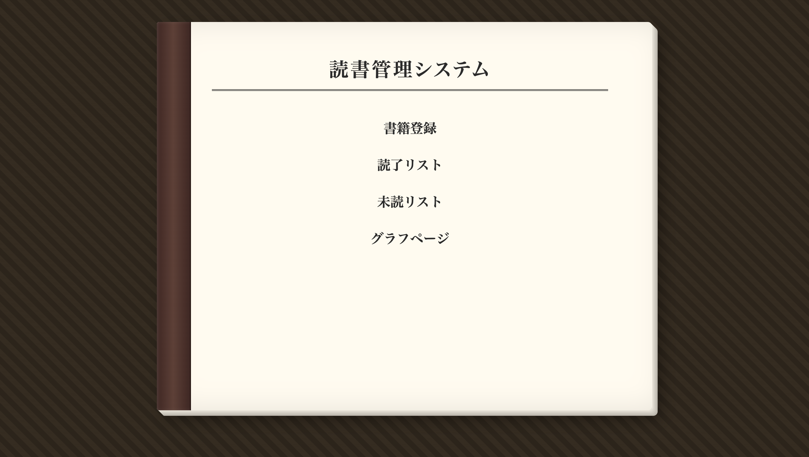
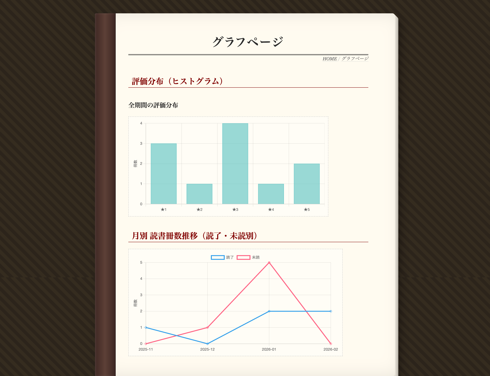
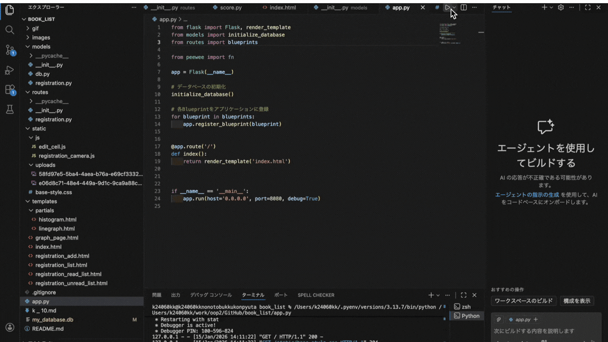

# book_list
# 読書管理アプリ

## 概要
今までに読んだ本、これから読みたい本を記録し、読書傾向を可視化するためのアプリケーションです。
書籍のタイトル、著者、評価、感想、写真などを保存し、今までの読書量をグラフで確認することができます。


## 開発背景：解決したい課題と目的
### 背景とニーズ
本を読み終えた直後は感動や学びが多くあっても、時間が経つと「どんな内容だったか」「どこに惹かれたのか」を忘れてしまうことが多々あります。
「手軽に振り返りができる仕組み」と、「視覚的に読書体験を思い出すきっかけ」が必要です。

### 本アプリの目的
本アプリは、単なるタイトル管理ではなく、以下の3点を実現するために開発しました。
1. **読んだ時の感動を残す**: 読後すぐに感想をアウトプットし、いつでも読み返せる状態にする。
2. **読んだ本の視覚化**: 本の表紙をカメラで撮影して記録することで、文字情報よりも強く当時の記憶を呼び起こす。
3. **継続のモチベーション**: 読書量をグラフ化することで、「これだけ読んできた」という達成感を可視化し、次の一冊へ繋げる。


## アピールポイント
* **カメラ連携**: 登録時にカメラを使用して、書籍などの撮影・記録が可能です。
* **読書の可視化**: Chart.jsを利用し、登録データを視覚的に分析可能です。
* **柔軟なソート機能**: 読了リストでは、複数の項目での並び替えに対応しています。


## 主なページと機能


| Topページ | 書籍登録ページ |
|-----------|----------------|
|  |  |
| 入り口となるメインメニューです。各機能へアクセスできます。 | カメラで表紙を撮影し、タイトルや評価をデータベースに登録できます。 |


| 読了一覧ページ | 未読一覧ページ |
|----------------|----------------|
|  |  |
| 読み終わった本を一覧で表示します。タイトルや著者名、評価順でのソートが可能です。 | 未読の本を管理します。読み始めたら読了リストへ移動できます |


| グラフページ |
|-------------|
|  |
| 登録されたデータを月別・年別で集計し、本の推移や傾向を可視化します。 |


## 動作条件

- 本アプリは、基本的にアプリを実行している端末上での利用を想定しています
- HTTP通信で動作しているため、スマートフォン等の別端末からアクセスした場合、
  カメラ機能（getUserMedia）が制限されることがあります
  
### 必須環境
- **Python**: 3.13.7
- **データベース**: SQLite3

### 使用技術・ライブラリ

#### バックエンド
- **Flask**：Webアプリケーションフレームワーク
- **Peewee**：ORM（SQLite操作）

#### フロントエンド
- **HTML / CSS**
- **JavaScript**
  - getUserMedia API（カメラ制御）
  - Canvas API（画像キャプチャ）

#### 可視化
- **Chart.js**：読書データのグラフ表示


## 開発者問い合わせ先

|担当者(Githubアカウント)|役割|
|-|-|
|taketo987|グループリーダー|
|kuwabatakenonaka|書籍登録機能|
|1018hiroto|未読リスト表示機能|
|natsumeg77|読了リスト表示機能|
|kinoko-1015|グラフ、デザインの作成|

## 使い方

### 1. ライブラリのインストール
```bash
pip install flask peewee
```

### 2.ブラウザでのアクセスとカメラ設定
1.プログラム実行後、ブラウザで http://127.0.0.1:8080 を開きます。  
2.ブラウザのURLバー左端にあるインフォメーションマーク（または鍵マーク）をクリックします。  
3.「サイトの設定」を選択し、権限設定の一覧から「カメラ」を許可にしてください。  
※カメラを許可しないと、アプリ内の撮影機能が正常に動作しません。




### 3.書籍の登録手順
1.「書籍追加」画面に移動し、タイトル・著者・評価・備考などの必要事項を入力します。  
2.画面上の「撮影」ボタンを押し、カメラで書籍をキャプチャします。  
3.内容を確認し、「登録」ボタンを押して保存します。  


## ディレクトリ構造
```
book_list/
├── app.py                 # Flaskアプリのエントリーポイント
├── models/                # データベース関連
│   ├── __init__.py        # DB初期化・モデル登録
│   ├── db.py              # DB接続設定
│   └── registration.py    # 書籍登録モデル
├── routes/                # ルーティング
│   ├── __init__.py
│   └── registration.py    # 登録関連ルート
├── static/                # 静的ファイル
│   ├── base-style.css
│   ├── js/
│   │   ├── edit_cell.js
│   │   └── registration_camera.js
│   └── uploads/           # 画像アップロード先
└── templates/             # HTMLテンプレート
    ├── index.html
    ├── registration_add.html
    ├── registration_list.html
    ├── registration_read_list.html
    ├── registration_unread_list.html
    ├── graph_page.html
    └── partials/
        ├── histogram.html
        └── linegraph.html


```
