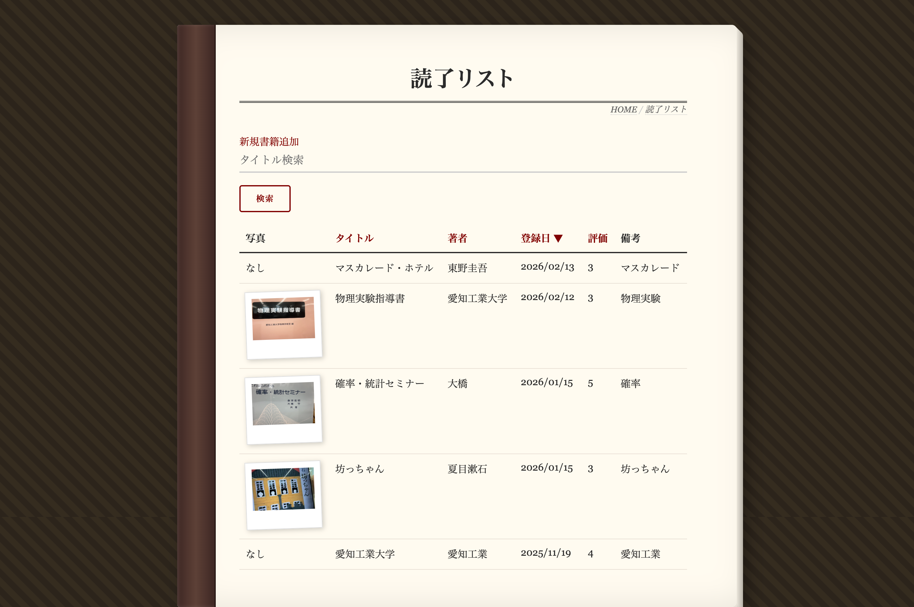

# book_list
# 読書管理アプリ

## 概要
今までに読んだ本、これから読みたい本を記録し、読書傾向を可視化するためのアプリケーションです。
書籍のタイトル、著者、評価、感想、写真などを保存し、今までの読書量をグラフで確認することができます。

## アピールポイント
* **カメラ連携**: 登録時にカメラを使用して、書籍などの撮影・記録が可能です。
* **読書の可視化**: Chart.jsを利用し、登録データを視覚的に分析可能です。
* **柔軟なソート機能**: 読了リストでは、複数の項目での並び替えに対応しています。

 

## 主なページと機能

|Topページ|書籍登録ページ|
|-|-|
|||
|tmp|tmp|

|読了一覧ページ|未読一覧ページ|
|-|-|
|||
|tmp|tmp|

|グラフページ|
|-|
|
|tmp|


## 動作条件
### 必須環境
* **Python**: 3.13.7
* **データベース**: SQLite3

### 必要なライブラリ
* **Flask**: Webフレームワーク
* **Peewee**: ORM

## 使い方
## 開発者問い合わせ先

|担当者(Githubアカウント)|役割|
|-|-|
|taketo987|グループリーダー|
|kuwabatakenonaka|書籍登録機能|
|1018hiroto|未読リスト表示機能|
|natsumeg77|読了リスト表示機能|
|kinoko-1015|グラフ、デザインの作成|


### 1. ライブラリのインストール
```bash
pip install flask peewee
```

### 2.ブラウザでのアクセスとカメラ設定
1.プログラム実行後、ブラウザで http://127.0.0.1:8080 を開きます。  
2.ブラウザのURLバー左端にあるインフォメーションマーク（または鍵マーク）をクリックします。  
3.「サイトの設定」を選択し、権限設定の一覧から「カメラ」を許可にしてください。  
※カメラを許可しないと、アプリ内の撮影機能が正常に動作しません。


### 3.書籍の登録手順
1.「書籍追加」画面に移動し、タイトル・著者・評価などの必要事項を入力します。  
2.画面上の「撮影」ボタンを押し、カメラで書籍をキャプチャします。  
3.内容を確認し、「登録」ボタンを押して保存します。  